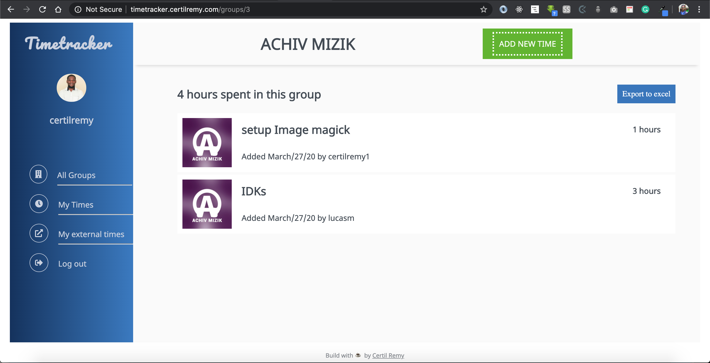

#   Time Tracker
Timetracker is an application to help you track and group your working time. You can group your time by a business, project or leave them blanks as external time. You can add your own group to group your time. You don't need to spend time calculating your time for a specific group, the app displays the amount of time you spent on each group you worked on.

<p align="center">
    
</p>

## Live version of the production
http://timetracker.certilremy.com/

### Feature Currently available:

* Create time an associate it to a group
* Create group
* Display group alphabetically
* Display external time
* Display time by most recent
* Display a single group with time on this group
* Pagination to list times and groups.
* Download group times in excel format


### New features in production :

* Set time to private or public
* Track time automatically with javascrips like T-shit
* Search for time and group 
* Download Group time to pdf
* Cache data with redis db

## Tech used 
* Html
* CSS
* Ruby on Rails
* SQLite for developement 
* postgreSQL  for production

## External Gem used 

* Will paginate (For pagination)
* PostgreSQL (Gem 'pg') for production database
* axlsx_rails For Exporting Group data to Excel 
* Rspec for Unit test 

## Using the app in development 
Clone this repo (you need ruby installed in your computer).
```
$ git clone git@github.com:certilremy/time_tracker.git
```

 Change to the app directory 
 
 ```
    $ cd time_tracker
 ```

   And run 

```
$ bundle install 
```

Then 

```
$ rails db:migrate 
```
To start the server 

```
$ rails s
```
or 

```
$ rails start
```

## Runnin the test 

```
$ bundle exec rspec
```
## Author 

* Certil Remy    Twitter: https://twitter.com/certilremy

## Contribution 

If you want to contribute to this project you're welcome .
Follow the github code of conduit fork this repot and openl your pull request. 

## Design idea by Gregoire Vella on Behance 